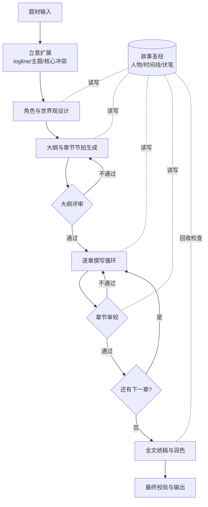

# MiniAgent

一个**与场景无关**的可复用 AI 工作流框架:提供 Stage(阶段)、ToolSet(能力挂载)、State Store(共享状态)、Loop(评审-修订循环)、ForEach(遍历子流程)、Checkpoint(人工断点)等通用构件。二次开发一个具体场景,通常只需要"定义 State Schema + 拼装这些原语 + 挂载/开发对应 ToolSet",而不需要重新设计流程结构。

当前第一个实例场景:**根据用户给定的题材,自动生成一篇中短篇小说。** 要让它"更专业地生产小说",预期的改动方式是打磨/扩充对应 Stage 上挂载的 ToolSet(如章节撰写、一致性评审),而不是改动引擎结构——详见 [docs/framework-design.md](docs/framework-design.md) §8。

## 为什么需要拆阶段,而不是一次性生成

直接让模型"根据题材写一篇小说"通常会遇到:大纲阶段的问题被带入全文导致返工代价极高、章节之间人物/设定前后矛盾、长文本超出上下文窗口后细节丢失、文笔和节奏难以自动把控。因此工作流按阶段拆解,并引入显式的状态存储与评审循环来约束质量——这些正是框架层要沉淀的通用构件。

## 小说生成工作流概览(框架的一个实例)



图中的 `{大纲评审}`/`{章节审校}` 是同一个 Loop 原语的两次实例化,`故事圣经` 是 State Store 的一个场景实例——细节见下方文档。

## 项目定位

- **框架层**([docs/framework-design.md](docs/framework-design.md)):Stage、ToolSet、State Store、Loop、ForEach、Checkpoint 等通用构件,不绑定"小说"这一场景,理论上可复用于代码审查、报告撰写等其他多阶段生成任务。这是二次开发时应该复用、不应该改动结构的部分。
- **场景层**([docs/workflow-design.md](docs/workflow-design.md) / [docs/story-bible-schema.md](docs/story-bible-schema.md)):小说生成工作流是第一个用来验证这套抽象是否好用的具体实例——用框架原语拼出流程,并挂载场景专属的 ToolSet 与 State Schema。

## 项目结构

框架层(`engine`/`agent`/`state`/`llm`/`tools`)不含任何场景语义,场景层内容全部落在 `scenarios/` 下。

```
miniagent/
├── engine/                     # 工作流引擎(框架核心,场景无关)
│   ├── stage.py                #   Stage:输入→输出契约 + Node 统一协议
│   ├── context.py              #   RunContext:运行期共享上下文 + 生命周期 hook
│   ├── workflow.py             #   Workflow:节点编排 + from_spec(声明式定义解析)
│   └── primitives/             #   四个控制流原语
│       ├── sequence.py         #     顺序执行
│       ├── loop.py             #     Critic-Reviser 循环(含超限策略)
│       ├── foreach.py          #     遍历子流程
│       └── checkpoint.py       #     人工断点(支持异步挂起/恢复)
│
├── agent/                      # 能力挂载层
│   ├── agent.py                #   Agent = LLM + 工具 + 工具集 + 记忆(agentic loop)
│   ├── toolset.py                #   ToolSet:一组 (func, schema)
│   └── memory.py               #   对话记忆(短期,区别于 State Store)
│
├── state/                      # 共享状态
│   ├── store.py                #   StateStore 抽象:get/patch/append/slice/snapshot
│   ├── schema.py               #   StateSchema:场景方定义字段与校验
│   └── backends/               #   内存后端 + JSON 文件后端(断点恢复)
│
├── llm/                        # LLM 抽象层
│   ├── client.py               #   LLMClient 接口 + ChatResponse
│   ├── message.py              #   Message / ToolCall 标准结构
│   └── providers/openai.py     #   OpenAI 兼容实现
│
├── tools/                      # 工具系统
│   ├── schema.py               #   ToolSchema + schema_from_func(自动生成)
│   ├── registry.py             #   ToolRegistry
│   └── executor.py             #   ToolExecutor(安全执行 + 异常回填)
│
└── scenarios/                  # 场景层:二次开发挂载点(见 scenarios/README.md)
```

> 框架层(`engine`/`agent`/`state`/`llm`/`tools`)已完成实现;`scenarios/` 下的具体场景(如小说生成)尚待落地。

## 关键设计点

1. **Node 统一协议** — Stage 和四个控制流原语都实现 `run(ctx, inputs)`,因此能任意嵌套(`ForEach` 的 body 可以是 `Loop`)。这是"用少量原语组合出任意流程"的基础。
2. **reads/writes 声明式** — Stage 显式声明需要读写的状态切片,既能只向 LLM 注入相关上下文(控制成本),又能做依赖分析(判断哪些 Stage 可并行)。
3. **Loop 的退出与超限策略** — "什么叫合格"由 critic 的输出决定,引擎不做假设;超限有 `accept_last / escalate_to_checkpoint / raise` 三种策略,杜绝死循环。
4. **两种记忆分离** — `agent/memory.py` 是单次 Agent 运行内的短期对话记忆;`state/` 是跨 Stage 的长期结构化事实。用摘要保证连贯,用结构化状态保证事实一致,职责分开。
5. **能力通过 ToolSet 挂载,而非改结构** — 换场景/做专业化的预期改动是"换一套 ToolSet + 换一份 State Schema",Stage/Loop/ForEach 的骨架不动。

## 二次开发一个新场景

参见 [docs/framework-design.md](docs/framework-design.md) §8 与 [scenarios/README.md](scenarios/README.md)。典型步骤:

1. 定义 `state_schema.py`(该场景要跨步骤追踪哪些事实)。
2. 开发 `toolsets/`(每个 Stage 需要的工具集,**主要工作量所在**)。
3. 在 `stages.py` 里把 ToolSet 挂到 Agent,组装成一个个 `Stage`。
4. 在 `workflow.py` 里用 Sequence/Loop/ForEach/Checkpoint 拼出流程。
5. 在 `run.py` 里组装 LLMClient / StateStore / RunContext 并运行。

## 文档

- [docs/framework-design.md](docs/framework-design.md) — **通用工作流框架设计**:核心原语定义、二次开发指南(先读这份)
- [docs/workflow-design.md](docs/workflow-design.md) — 小说生成工作流:框架原语在该场景下的具体实例化
- [docs/story-bible-schema.md](docs/story-bible-schema.md) — 故事圣经:State Store 在该场景下的具体 Schema

## 状态

框架层目录骨架已就位(接口签名 + 实现指导),具体逻辑与首个场景(小说生成)尚未实现。建议的实现顺序自底向上、每层可独立测试:`tools/` → `llm/` → `state/backends/` → `agent/` → `engine/primitives/` → `engine/workflow.py`,最后落到 `scenarios/novel/`。
