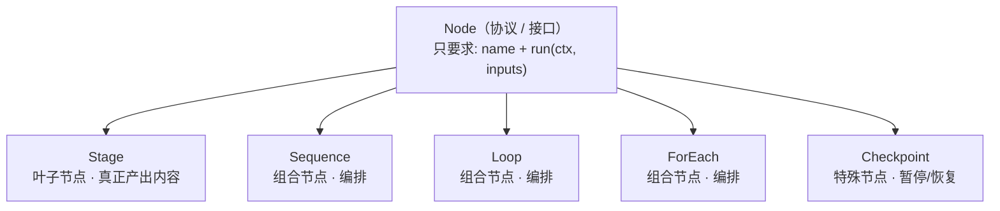

# 可复用 AI 工作流框架设计

本文档定义的是**与场景无关**的工作流引擎抽象。任何具体场景(小说生成、代码审查、报告撰写…)都不修改这一层,而是通过"提供 State Schema + 编写 Workflow 定义 + 挂载/开发 Skill"在其上二次开发。小说生成工作流([workflow-design.md](workflow-design.md))是这套抽象的第一个实例,不是框架本身。

## 1. 设计目标

- **场景无关**:引擎只提供结构(阶段怎么串联、状态怎么读写、循环怎么退出),不内置任何"大纲""章节"之类的语义。
- **组合优于内置**:复杂流程由少量控制流原语(顺序/循环/遍历/断点)组合而成,而不是为每种流程单独写死代码。
- **能力通过 Skill 挂载,而非改结构**:换场景时,期望的改动是"换一套 Skill + 换一份 State Schema",而不是重新设计流程图。

## 2. 核心概念一览

| 概念 | 作用 | 场景相关? |
|---|---|---|
| Node | **协议(接口)**,规定"可执行节点长什么样":有 `name` + `run(ctx, inputs)`。Stage 与四个控制流原语都是它的实现 | 否(接口) |
| Stage | 最小执行单元,是 Node 的**叶子实现**(真正产出内容),声明 input/output 契约 | 否(容器);场景相关的是挂在它上面的 Agent/Skill |
| Agent | LLM + ToolRegistry + Skills + Memory,Stage 的典型执行体 | 否(结构),Skill 决定它做什么 |
| Skill | 一组工具(function + schema),赋予 Agent 特定能力 | **是** —— 这是场景方二次开发的主要挂载点 |
| State Store | 通用的结构化共享状态读写接口 | 否(接口);字段语义由场景方提供的 Schema 决定 |
| Loop(Critic-Reviser) | "生成→评审→修订→直到达标或超限"的通用循环原语 | 否 |
| ForEach | 对列表中每个元素重复执行子流程 | 否 |
| Checkpoint | 暂停等待外部(人工)输入的通用断点 | 否(是否设置由场景方决定) |
| Workflow 定义 | 场景方用上述原语拼出的具体流程 | 是 |

## 3. Node 与 Stage —— 执行协议与最小执行单元

### 3.1 Node —— 统一执行协议(接口,不是类)

初读容易把 Node 和 Stage 当成两个平级、职责重叠的概念。它们其实**不在同一层级**:

- **Node 是"协议 / 接口"(Python `Protocol`),不是一个可实例化的类。** 它只规定一件事:凡是想被引擎当成"一步"来驱动的东西,都必须有 `name` 和 `run(ctx, inputs) -> outputs`。Node 本身没有任何实现体。
- **Stage 是 Node 的具体实现之一。** 除了 Stage,四个控制流原语(Sequence / Loop / ForEach / Checkpoint)也都实现了 Node。



打个比方:Node 相当于 `interface Runnable`,Stage 相当于 `class XxxTask implements Runnable`——一个是契约,一个是履行契约的人,不存在"职责冲突"。

**为什么要单独抽象出 Node,而不是只留 Stage?** 因为框架的核心卖点是"少量原语任意嵌套组合",而 Node 正是这一点在类型层面的粘合剂:

- `Loop.producer / critic / reviser` 的类型是 `Node`
- `ForEach.body` 的类型是 `Node`
- `Sequence.nodes` 的类型是 `list[Node]`

正因为它们只要求"是个 Node",所以 `ForEach` 的 body 可以塞一个 `Loop`、`Loop` 的 producer 可以塞一个 `Stage`——任意层级的嵌套组合才成立。如果没有 Node、这些原语写死"我只能装 Stage",嵌套就没了。

| | **Node** | **Stage** |
|---|---|---|
| 是什么 | 协议 / 接口(`Protocol`) | 一个具体 `dataclass` |
| 层级 | 抽象 | 实现(五种节点之一) |
| 有 run 实现吗 | 没有,只声明签名 | 有,真正的执行逻辑 |
| 还有谁是它 | Sequence / Loop / ForEach / Checkpoint | —— |
| 职责 | 规定"可执行节点统一长什么样" | 把一步"输入→输出"落地:校验、读切片、调 executor、写回 |

一句话:**Node 定义"什么算一个可执行的步骤";Stage 是"其中会真正产出内容的那一种步骤"。前者是形状,后者是内容。**

### 3.2 Stage —— 最小执行单元

```
Stage:                              # 实现 Node 协议
  name: str
  input_schema: Schema
  output_schema: Schema
  executor: Agent | Callable        # 谁来完成 input -> output
  reads:  list[StatePath]           # 声明式:需要从 State Store 读哪些切片
  writes: list[StatePath]           # 声明式:会往 State Store 写哪些切片(可为空)
```

`reads`/`writes` 是声明式的,好处有两个:一是执行时可以只把相关状态切片注入上下文,避免把全量状态都塞给模型;二是这些声明本身可以用来做依赖分析(比如判断哪些 Stage 之间没有状态依赖、理论上可以并行)。

注意 **`writes` 是可选的、默认为空——不是每个 Stage 都会写 State Store。** 数据有两条通道:①上一个节点的 `outputs` 直接作为下一个节点的 `inputs`(揮发,不落 State);②只有 `writes` 声明的切片才写回 State Store。仅当某个事实需要被**非相邻的后段**读取(如故事圣经在角色设计阶段写、逐章撰写/统稿阶段才读),或需要追加历史 / 支持断点恢复时,才写 State。Loop 内 critic 的 `{passed, feedback}` 只被相邻的 reviser 消费,通常走通道①、不落 State。

Stage 不关心"怎么产出输出"——它只是一个契约。同一个 Stage 定义换一个 executor(比如换一个挂载了不同 Skill 的 Agent),就能在不同场景里做完全不同的事,这是场景可替换性的关键。

## 4. Agent 与 Skill —— 场景能力的挂载点

延续框架原有的概念:**Agent = LLM Client + ToolRegistry + Skills(工具集) + Memory**。Skill 是一组 `(tool_func, schema)`,可以被加载进 Agent,决定这个 Agent 具备什么能力。

这是本框架回应"二次开发只需要装 Skill"这个诉求的核心机制:

- Stage 的结构(它在流程图里的位置、它的输入输出契约、它是否处于某个 Loop/ForEach 里)是**引擎层**决定的,不因场景而变。
- Stage 具体"怎么把输入变成输出"是**Skill 层**决定的:给同一个抽象的"生成"Stage 挂载不同 Skill,就得到不同场景下的能力。
- 给同一个抽象的"评审"Stage 挂载 `novel_critique_skill`,就是小说评审;挂载 `code_review_skill`,就是代码评审——Stage 本身、它所在的 Loop 结构完全不用改。

也就是说,专业化一个场景(比如让它"专业地生产小说")的典型工作量是:**写清楚这个场景需要哪些 Skill,并把它们挂到对应 Stage 上**,而不是重新设计流程图。

## 5. State Store —— 通用共享状态接口

```
StateStore:
  get(path) -> value
  patch(path, value)                 # 增量更新
  append(path, value)                # 追加型字段(如日志/历史记录)使用,不覆盖历史
  slice(paths: list[StatePath]) -> dict   # 按需切片读取,控制注入上下文的状态规模
```

引擎本身不关心 `path` 指向的字段语义。场景方通过提供一份 **State Schema** 来定义这份共享状态长什么样(小说场景的 Schema 见 [story-bible-schema.md](story-bible-schema.md),那是一个具体实例,不是引擎的一部分)。

## 6. 控制流原语

四个原语足以组合出目前设想的所有流程形态:

### 6.1 Sequence(顺序)

`A -> B -> C`,上一个 Stage 的输出流入下一个 Stage 的输入(可能还要经过 State Store 中转)。

### 6.2 Loop(Critic-Reviser 循环)

通用的"生成 → 评审 → 修订"循环,参数化为:

```
Loop:
  producer: Stage              # 产出待评审内容(首轮)
  critic: Stage                # 输出 {pass: bool, feedback: str}
  reviser: Stage                # 依据 feedback 修订 producer 的输出
  max_iterations: int
  on_exceed: retry_forever_forbidden | escalate_to_checkpoint | accept_last_version
```

退出条件由 `critic` 的输出决定,不由引擎假设"什么叫合格"。这个原语在小说场景里被复用了两次(大纲评审、章节审校),这正是它被设计为独立原语而非内置逻辑的原因——写一次,任意层级复用。

### 6.3 ForEach(遍历子流程)

把经典 for-each 循环搬到编排层:`for (i = 0; i < len(items); i++) { body }`。

```
ForEach:
  items_path: StatePath        # 待遍历列表的状态路径,逐个遍历
  body: Node                   # 对每个元素执行的子流程(Stage / Loop / Sequence)
  index_path: StatePath        # 游标——当前下标(默认 _foreach.<name>.index),同时是恢复点
  item_path: StatePath         # 游标——当前元素(默认 _foreach.<name>.item),body 用 reads 读它
```

**ForEach 只负责"重复"这一件事,不负责"连贯性"。** 每轮做三步:condition(`i < len(items)`)→ bind(把 `items[i]` 发布到游标 `item_path`)→ advance(`i++`)。body 每轮通过它自己的 `reads=[item_path]` 读到当前元素,和任何一个普通 Stage 读状态切片完全一样——不存在"塞进 inputs 的魔法键"。

而"各项之间保持连贯"(逐章写作时第 N 章要看到前 N-1 章的产物)**不是 ForEach 的职责**:它是 body 里各 Stage 对共享 State Store 做 `reads`/`writes` 的自然结果。所以这里既没有、也不需要 `shared_state` 之类的开关。小说里的"逐章撰写"就是 `ForEach(chapters, body=Loop(draft, review, revise))`,其连贯性来自 body 内部读一份滚动摘要 / 故事圣经,而非 ForEach 把前文全喂回去(见 §5 上下文成本控制)。

游标 `index_path` 存在 State Store 里,因此"从中断处恢复"是白捡的:从 Checkpoint 快照续跑时,发现下标已有值就接着往下走。整个节点全由数据字段描述,可从 §7 的 YAML 直接拼出,不含任何运行期回调。

### 6.4 Checkpoint(人工断点)

```
Checkpoint:
  name: str
  resume_input_schema: Schema   # 恢复执行时需要的外部输入(如"批准"或"修改意见")
```

流程执行到这里暂停,等待外部输入后再继续。是否设置、设置在哪里,完全由场景方在 Workflow 定义里决定,引擎只提供"能暂停并恢复"这个能力。

## 7. Workflow 定义 —— 场景方的组合方式

场景方通过组合以上原语 + 提供 State Schema + 挂载 Skill 来定义一个具体工作流,形式上类似:

```yaml
workflow: <场景名称>
state_schema: <指向该场景的 State Schema 定义>

stages:
  - sequence: [stage_a, stage_b]

  - loop:
      producer: stage_c
      critic: stage_c_critic
      reviser: stage_c_reviser
      max_iterations: 3
      on_exceed: escalate_to_checkpoint

  - checkpoint: confirm_before_continue

  - foreach:
      items_path: <某个列表状态字段>   # 逐个遍历它;当前元素每轮发布到游标 item_path
      body:                            # body 里的 Stage 用 reads=[<item_path>] 读当前元素
        loop:
          producer: stage_d
          critic: stage_d_critic
          reviser: stage_d_reviser
          max_iterations: 2

  - sequence: [stage_e, stage_f]

skills:
  stage_a: [skill_x]
  stage_c: [skill_y, skill_z]
  stage_d: [skill_w]
  # ...每个 Stage 的 executor(Agent)挂载哪些 Skill
```

这份定义完全没有出现"大纲""章节""小说"这类词——它是纯结构。小说生成工作流就是往这个结构里填入具体的 Stage、Skill 和 State Schema 之后得到的一个实例。

## 8. 二次开发指南

要在这套框架上做出一个"专业地生产 X"的具体场景,典型步骤:

1. **定义 State Schema**:这个场景需要跨步骤追踪哪些事实/状态。
2. **拆 Stage**:把整个任务拆成若干输入输出明确的步骤,写出每个 Stage 的 `input_schema`/`output_schema`。
3. **识别需要质检的环节**,给对应 Stage 套一层 `Loop`(producer/critic/reviser + 退出条件)。
4. **识别需要对列表重复处理的环节**(如"逐章"/"逐条"),套一层 `ForEach`。
5. **决定哪些节点需要人工介入**,插入 `Checkpoint`。
6. **为每个 Stage 开发/挂载 Skill**——这是主要的开发工作量所在,流程结构(2–5 步)通常一次设计好之后很少再变。
7. 组装成 Workflow 定义并运行。

## 9. 已验证的实例:小说生成

[workflow-design.md](workflow-design.md) 是按上述步骤产出的第一个具体实例:

- 其中的每个阶段(立意扩展、角色设计、大纲生成…)都是一个 Stage 配置。
- 大纲评审(3.5)、章节审校(3.8)都是同一个 `Loop` 原语的两次独立实例化。
- 逐章撰写(3.6)是 `ForEach(chapters, body=Loop(...))` 的实例化。
- 故事圣经([story-bible-schema.md](story-bible-schema.md))是 State Schema 的一个具体实例,不属于引擎本身。

要让这套流程"更专业地生产小说",在当前设计下应优先考虑:开发更强的 `chapter_writing_skill`/`novel_critique_skill` 等 Skill,或调整 State Schema 里追踪的字段——都不需要改动 Stage/Loop/ForEach 这层结构。

## 10. 非目标(Out of Scope)

引擎层刻意不规定:

- 具体 Prompt 内容与措辞
- 具体 LLM Provider 的选择与调用方式
- 具体的 UI/CLI 交互形式
- Skill 内部工具的实现细节

这些都留给实现层和场景层各自决定,以保证引擎本身能被不同场景复用。
