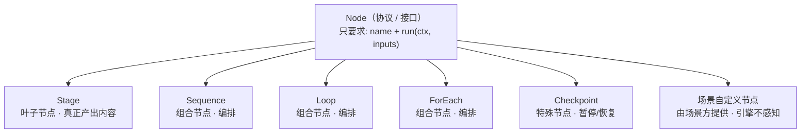

# 可复用 AI 工作流框架设计

本文档定义的是**与场景无关**的工作流引擎抽象。任何具体场景(小说生成、代码审查、报告撰写…)都不修改这一层,而是通过"提供 State Schema + 编写 Workflow 定义 + 挂载/开发 ToolSet"在其上二次开发。小说生成工作流([workflow-design.md](workflow-design.md))是这套抽象的第一个实例,不是框架本身。

## 1. 设计目标

- **场景无关**:引擎只提供结构(阶段怎么串联、状态怎么读写、循环怎么退出),不内置任何"大纲""章节"之类的语义。
- **组合优于内置**:复杂流程由少量控制流原语(顺序/循环/遍历/断点)组合而成,而不是为每种流程单独写死代码。
- **能力通过 ToolSet 挂载,而非改结构**:换场景时,期望的改动是"换一套 ToolSet + 换一份 State Schema",而不是重新设计流程图。

## 2. 核心概念一览

| 概念 | 作用 | 场景相关? |
|---|---|---|
| Node | **协议(接口)**,规定"可执行节点长什么样":有 `name` + `run(ctx, inputs)`。Stage 与四个控制流原语都是它的实现 | 否(接口) |
| Stage | 最小执行单元,是 Node 的**叶子实现**(真正产出内容),声明 input/output 契约 | 否(容器);场景相关的是挂在它上面的 Agent/ToolSet |
| Agent | LLM + ToolRegistry + ToolSets + Memory,Stage 的典型执行体 | 否(结构),ToolSet 决定它做什么 |
| ToolSet | 一组工具(function + schema),赋予 Agent 特定能力。注意:这是代码装配期显示挂载的工具组,和 Claude/OpenAI 里"运行时由模型自主发现"的 Skill 概念不是一回事(见 §4)| **是** —— 这是场景方二次开发的主要挂载点 |
| State Store | 通用的结构化共享状态读写接口 | 否(接口);字段语义由场景方提供的 Schema 决定 |
| Loop(迭代) | "对同一份输入反复跑一串节点,直到某个判定不再要求重来或超限"的通用循环原语 | 否 |
| ForEach | 对列表中每个元素重复执行子流程 | 否 |
| Checkpoint | 暂停等待外部(人工)输入的通用断点 | 否(是否设置由场景方决定) |
| Workflow 定义 | 场景方用上述原语拼出的具体流程 | 是 |

## 3. Node 与 Stage —— 执行协议与最小执行单元

### 3.1 Node —— 统一执行协议(接口,不是类)

初读容易把 Node 和 Stage 当成两个平级、职责重叠的概念。它们其实**不在同一层级**:

- **Node 是"协议 / 接口"(Python `Protocol`),不是一个可实例化的类。** 它只规定一件事:凡是想被引擎当成"一步"来驱动的东西,都必须有 `name` 和 `run(ctx, inputs) -> outputs`。Node 本身没有任何实现体。
- **Stage 是 Node 的具体实现之一。** 除了 Stage,四个控制流原语(Sequence / Loop / ForEach / Checkpoint)也都实现了 Node。**场景方也可以自己写一个满足 Node 的类型**(见 §6.5)。



打个比方:Node 相当于 `interface Runnable`,Stage 相当于 `class XxxTask implements Runnable`——一个是契约,一个是履行契约的人,不存在"职责冲突"。

**为什么要单独抽象出 Node,而不是只留 Stage?** 因为框架的核心卖点是"少量原语任意嵌套组合",而 Node 正是这一点在类型层面的粘合剂:

- `Loop.body` 的类型是 `list[Node]`
- `ForEach.body` 的类型是 `Node`
- `Sequence.nodes` 的类型是 `list[Node]`

正因为它们只要求"是个 Node",所以 `ForEach` 的 body 可以塞一个 `Loop`、`Loop` 的 body 里可以混着 `Stage` 和 `Checkpoint`——任意层级的嵌套组合才成立。如果没有 Node、这些原语写死"我只能装 Stage",嵌套就没了。

| | **Node** | **Stage** |
|---|---|---|
| 是什么 | 协议 / 接口(`Protocol`) | 一个具体 `dataclass` |
| 层级 | 抽象 | 实现(五种节点之一) |
| 有 run 实现吗 | 没有,只声明签名 | 有,真正的执行逻辑 |
| 还有谁是它 | Sequence / Loop / ForEach / Checkpoint,以及场景方自定义的节点 | —— |
| 职责 | 规定"可执行节点统一长什么样" | 把一步"输入→输出"落地:校验、读切片、调 executor、写回 |

一句话:**Node 定义"什么算一个可执行的步骤";Stage 是"其中会真正产出内容的那一种步骤"。前者是形状,后者是内容。**

### 3.2 Stage —— 最小执行单元

```
Stage:                              # 实现 Node 协议
  name: str
  input_schema: Schema
  output_schema: Schema
  executor: Agent | Callable        # 谁来完成 input -> output
  reads:  list[StatePath]           # 声明式:需要从 State Store 读哪些切片
  writes: list[StatePath]           # 声明式:会往 State Store 写哪些切片(可为空)
```

`reads`/`writes` 是声明式的,好处有两个:一是执行时可以只把相关状态切片注入上下文,避免把全量状态都塞给模型;二是这些声明本身可以用来做依赖分析(比如判断哪些 Stage 之间没有状态依赖、理论上可以并行)。

注意 **`writes` 是可选的、默认为空——不是每个 Stage 都会写 State Store。** 数据有两条通道:①上一个节点的 `outputs` 直接作为下一个节点的 `inputs`(揮发,不落 State);②只有 `writes` 声明的切片才写回 State Store。仅当某个事实需要被**非相邻的后段**读取(如故事圣经在角色设计阶段写、逐章撰写/统稿阶段才读),或需要追加历史 / 支持断点恢复时,才写 State。

一个例外是 `Loop` 的游标 `_loop.<name>.last`:评审意见要跨**轮次**送到下一轮的第一个节点,通道①(节点间的 outputs->inputs)只在一轮之内有效,所以它由引擎写进 State 的 `_loop.*` 记账命名空间,由下一轮的生成节点用普通 `reads` 读取。手法与 `ForEach` 的 `_foreach.*` 游标一致。

Stage 不关心"怎么产出输出"——它只是一个契约。同一个 Stage 定义换一个 executor(比如换一个挂载了不同 ToolSet 的 Agent),就能在不同场景里做完全不同的事,这是场景可替换性的关键。

## 4. Agent 与 ToolSet —— 场景能力的挂载点

延续框架原有的概念:**Agent = LLM Client + ToolRegistry + ToolSets(工具集) + Memory**。ToolSet 是一组 `(tool_func, schema)`,可以被加载进 Agent,决定这个 Agent 具备什么能力。

> **与 Claude/OpenAI 的 "Skill" 概念的区别**:Claude/OpenAI 的 Skill 是运行时机制——一个磁盘目录(带元数据),模型在对话过程中自主发现、按需渐进式家在。本框架的 ToolSet 是装配期机制——由场景方在组装 Agent 的代码里显示挂载,决定这个 Agent 从一开始具备什么能力,不涉及运行时的目录扫描或模型自主发现。两者解决的事不同层面的问题,命名上刻意使用"ToolSet"以免混淆。

这是本框架回应"二次开发只需要装 ToolSet"这个诉求的核心机制:

- Stage 的结构(它在流程图里的位置、它的输入输出契约、它是否处于某个 Loop/ForEach 里)是**引擎层**决定的,不因场景而变。
- Stage 具体"怎么把输入变成输出"是**ToolSet 层**决定的:给同一个抽象的"生成"Stage 挂载不同 ToolSet,就得到不同场景下的能力。
- 给同一个抽象的"评审"Stage 挂载 `novel_critique_toolset`,就是小说评审;挂载 `code_review_toolset`,就是代码评审——Stage 本身、它所在的 Loop 结构完全不用改。

也就是说,专业化一个场景(比如让它"专业地生产小说")的典型工作量是:**写清楚这个场景需要哪些 ToolSet,并把它们挂到对应 Stage 上**,而不是重新设计流程图。

## 5. State Store —— 通用共享状态接口

```
StateStore:
  get(path) -> value
  patch(path, value)                 # 增量更新
  append(path, value)                # 追加型字段(如日志/历史记录)使用,不覆盖历史
  slice(paths: list[StatePath]) -> dict   # 按需切片读取,控制注入上下文的状态规模
```

引擎本身不关心 `path` 指向的字段语义。场景方通过提供一份 **State Schema** 来定义这份共享状态长什么样(小说场景的 Schema 见 [story-bible-schema.md](story-bible-schema.md),那是一个具体实例,不是引擎的一部分)。

## 6. 控制流原语

四个原语足以组合出目前设想的所有流程形态:

### 6.1 Sequence(顺序)

`A -> B -> C`,上一个 Stage 的输出流入下一个 Stage 的输入(可能还要经过 State Store 中转)。

### 6.2 Loop(迭代)

**同一份输入,反复尝试到满意为止。** 和 `ForEach` 的分工是:`ForEach` 遍历 N 个不同的元素、由数据耗尽决定停;`Loop` 反复处理同一份数据、由一个判定决定停。和 `Sequence` 的分工只差"跑几次":`Sequence` 跑 1 次,`Loop` 最多跑 `max_iterations` 次。

```
Loop:
  body: list[Node]             # 一轮依次执行它们(Sequence 的规则:上一个 outputs 流入下一个 inputs)
  continue_when: StatePath     # 是非器——每个 body 节点跑完后取它的真假,真则重开一轮
  max_iterations: int
  on_exceed: raise | escalate_to_checkpoint | accept_last_version
```

每一轮都从**同一份 inputs** 重新开始,轮次之间不累积。一轮内部每个节点跑完做两件事:

1. 把它的 outputs 整块发布到游标 `_loop.<name>.last`(整块**替换**,不是合并);
2. 读 `continue_when` 指向的状态路径,真则本轮到此为止、从 `body[0]` 重开一轮。

第 2 条是这个原语唯一的判定机制,刻意做成"读一条状态路径取真假",于是:

- **引擎不认识任何业务字段名。** 没有 `passed` 也没有 `feedback`,判定字段叫什么、由谁产出,全在 `workflow.yaml` 里指给它看。这与 §6.5 的判断标准一致:"什么情况下算合格"是场景的事。
- **不需要表达式语言,也不需要场景侧的谓词回调。** 真需要复杂判定的场景,就在 `body` 里加一个节点把结果算出来写进 State——计算属于节点,不属于一个特殊槽位。
- **极性是固定的:真 = 还要再来一轮。** 所以被读的字段要朝着"还得改"为真去命名(如 `needs_revision`)而不是 `passed`——裸路径取真假没有取反的余地,这是刻意的:一旦支持取反就得引入表达式语言。
- 路径缺失时读到 `None`、判为假,所以 `body` 里不产出判定字段的节点(比如生成节点)不会误触发重开一轮。

第 1 条的游标顺带解决"下一轮怎么知道上一轮为什么没过":`body[0]` 用普通的 `reads=["_loop.<name>.last"]` 就能读到上一个节点的产出(通常正是驳回它的那份评审意见)。整块替换而非合并是正确性要求——否则上一轮的判定字段会残留,是非器读到陈旧的真值就永远重开。循环正常结束时游标被清掉,避免泄漏给后续节点、也避免大对象长期躺在持久化快照里;但 `body` 里的 `Checkpoint` 暂停时**不清**,续跑还要靠它读回意见。

判定放在**每个节点之后**而不是整条 `body` 之后,于是"多道关卡"是白拿的:`body: [生成, AI 评审, 人工确认]` 天然就是"AI 先挡掉明显问题、通过后才让人工把关",且 AI 判否时人工那一关根本不执行(不必拿一份 AI 都没过的草稿去打扰人)。**这是它取代早期那个 `producer/critic/reviser` 三槽位版本的主要理由**:那个版本把三个节点的角色写死在引擎里,而"生成"与"修订"在实践中往往是同一个节点(游标为空就是生成,游标里带着意见就是修订),"评审"又往往不止一关——都是场景自己的编排,不该由原语规定。

返回值是最后一个节点的 outputs,外加一份 `_loop: {name, iterations, exhausted}` 记账,让循环后面的节点能区分"是通过了"还是"跑满轮次被 `on_exceed` 放行的",而不必自己猜。

**本原语不对返回值做任何投影或裁剪**,所以它可能带着一些循环内部的中间字段(典型如最后那一关的判定与评审意见)按通道①流进循环后面的节点。这是刻意不管的:`Loop` 对外的正式接口是"从 `continue_when` 这条状态路径读、往 `_loop.<name>.last` 这条状态路径写",两头都在 State 上;至于要不要把它的 outputs 当作后续节点的 inputs 来用,是场景方在自己的 Workflow 定义里决定的事,而每个节点真正需要什么本来就该由它自己的 `reads` 声明。原语不替场景猜"哪些字段该留、哪些该扔"——那是业务语义,不是控制流形状(§6.5)。

### 6.3 ForEach(遍历子流程)

把经典 for-each 循环搬到编排层:`for (i = 0; i < len(items); i++) { body }`。

```
ForEach:
  items_path: StatePath        # 待遍历列表的状态路径,逐个遍历
  body: Node                   # 对每个元素执行的子流程(Stage / Loop / Sequence)
  index_path: StatePath        # 游标——当前下标(默认 _foreach.<name>.index),同时是恢复点
  item_path: StatePath         # 游标——当前元素(默认 _foreach.<name>.item),body 用 reads 读它
```

**ForEach 只负责"重复"这一件事,不负责"连贯性"。** 每轮做三步:condition(`i < len(items)`)→ bind(把 `items[i]` 发布到游标 `item_path`)→ advance(`i++`)。body 每轮通过它自己的 `reads=[item_path]` 读到当前元素,和任何一个普通 Stage 读状态切片完全一样——不存在"塞进 inputs 的魔法键"。

而"各项之间保持连贯"(逐章写作时第 N 章要看到前 N-1 章的产物)**不是 ForEach 的职责**:它是 body 里各 Stage 对共享 State Store 做 `reads`/`writes` 的自然结果。所以这里既没有、也不需要 `shared_state` 之类的开关。小说里的"逐章撰写"就是 `ForEach(chapters, body=Loop(draft, review, revise))`,其连贯性来自 body 内部读一份滚动摘要 / 故事圣经,而非 ForEach 把前文全喂回去(见 §5 上下文成本控制)。

游标 `index_path` 存在 State Store 里,因此"从中断处恢复"是白捡的:从 Checkpoint 快照续跑时,发现下标已有值就接着往下走。整个节点全由数据字段描述,可从 §7 的 YAML 直接拼出,不含任何运行期回调。

### 6.4 Checkpoint(人工断点)

```
Checkpoint:
  name: str
  resume_input_schema: Schema   # 恢复执行时需要的外部输入(如"批准"或"修改意见")
```

流程执行到这里暂停,等待外部输入后再继续。是否设置、设置在哪里,完全由场景方在 Workflow 定义里决定,引擎只提供"能暂停并恢复"这个能力。

### 6.5 场景自定义节点 —— 不该新增原语的那些情况

上面四个原语刻意都是**控制流的形状**(顺序、循环、遍历、暂停),它们与场景无关,因此值得放进引擎。但很多需求虽然长得像"要一个新原语",本质上却是**某种策略**——策略属于场景,不属于引擎。

判断标准很简单:**它描述的是"执行结构长什么样",还是"什么情况下算合格 / 该怎么组织判断"?** 前者才是原语。

需要后者时,场景方**不必也不应该改引擎**:`Node` 是一个 Protocol(结构化类型),只要写一个带 `name` 和 `run(ctx, inputs) -> outputs` 的类,就自动是合法的 Node,可以直接塞进 `Loop.body`、`Sequence.nodes`、`ForEach.body`,与内置原语平起平坐——不需要继承任何基类,也不需要在引擎里登记类型。

一个真实例子(小说场景的 `_ChapterHumanReviewCheckpoint`,见 `scenarios/novel/stages.py`):它包住一个真正的 `Checkpoint`,在其返回之后补一刀状态写回(人工判否时把该章 status 打回 `drafted`)。"暂停/恢复"是控制流、归引擎;"人工判否之后该改哪个字段"是业务策略、归场景。

反面教材也值得记一笔:早期版本里,"AI critic 先挡掉明显问题、通过后再让人工把关"曾经是场景侧一个自定义的 `ReviewChain` 节点(把多个 critic 串起来短路求值,整体顶替 `Loop` 的 `critic` 槽位)。它之所以存在,是因为当时的 `Loop` 把 `producer/critic/reviser` 三个角色写死在引擎里、只留一个 critic 槽位。§6.2 改成 `body` + 每节点判定之后,"多道关卡"变成 `body` 里多列一项,那个自定义节点就被删掉了——**原语的形状选错时,成本会以"场景侧不得不写的胶水"的形式冒出来**,这也是判断原语是否选对的一个信号。

> 顺带说明:`Checkpoint.run()` 的返回值(流入的 `inputs` 与人工 `resume_input` 合并)天然是评审契约的超集,所以 `Checkpoint` 可以直接当 `Loop.body` 里的一关。"AI 评审 + 人工把关"因此是零成本组合出来的,不需要为它引入任何新概念(见 [workflow-design.md](workflow-design.md) §5)。

## 7. Workflow 定义 —— 场景方的组合方式

场景方通过组合以上原语 + 提供 State Schema + 挂载 ToolSet 来定义一个具体工作流,形式上类似:

```yaml
workflow: <场景名称>
state_schema: <指向该场景的 State Schema 定义>

stages:
  - sequence: [stage_a, stage_b]

  - loop:
      name: stage_c_review
      body: [stage_c, stage_c_critic]        # 一轮依次跑它们
      continue_when: _loop.stage_c_review.last.needs_revision   # 真则重开一轮
      max_iterations: 3
      on_exceed: escalate_to_checkpoint

  - checkpoint: confirm_before_continue

  - foreach:
      items_path: <某个列表状态字段>   # 逐个遍历它;当前元素每轮发布到游标 item_path
      body:                            # body 里的 Stage 用 reads=[<item_path>] 读当前元素
        loop:
          name: stage_d_review
          body: [stage_d, stage_d_critic]
          continue_when: _loop.stage_d_review.last.needs_revision
          max_iterations: 2

  - sequence: [stage_e, stage_f]
```

这份定义完全没有出现"大纲""章节""小说"这类词——它是纯结构:它只说"这些节点怎么串",不说"每个节点是什么"。后者是 §7.2 那份 `stages.yaml` 的职责。小说生成工作流就是往这两个结构里填入具体的 Stage、ToolSet 和 State Schema 之后得到的一个实例。

### 7.1 model —— 按子树指定模型

任意一个节点(`sequence`/`loop`/`foreach` 的容器,或单个 stage 引用)都可以额外标注一个 `model` 字段,和该节点自己的原语关键字同级出现:

```yaml
stages:
  - sequence: [concept_expansion, character_world_design]
    model: claude-sonnet-5   # 这个 sequence 及其包含的两个 Stage 都用这个模型

  - loop:
      name: outline_loop
      body: [outline_generation, outline_critic]
      continue_when: _loop.outline_loop.last.needs_revision
    model: claude-sonnet-5   # 这个 loop 及其 body 里的两个 Stage 都用这个模型

  - stage: chapter_critic
    model: claude-haiku-4-5   # 单个 Stage 也可以单独覆盖
```

子节点没有自己标注 `model` 时,继承最近的祖先节点声明的值,一路向下直到某个子节点自己覆盖为止;从未被任何祖先标注过的叶子 Stage,退回场景方 `client_factory` 的默认模型。这件事由 `engine.workflow.Workflow.resolve_stage_models` 在 Stage 对象真正被构造之前完成一次轻量的树形扫描(必须在那之前,因为 Stage 内部的 `LLMClient` 一旦造好就定死了),产出一份 `{stage 名: model}` 映射,交给场景方在 `client_factory(stage_name, model)` 里按 `model` 选择/复用对应的 Provider client(见 `scenarios/novel/run.py` 的 `make_client_factory`)——引擎本身不关心某个模型名具体对应哪个 Provider 的 SDK,那仍是场景方 `client_factory` 的职责。

### 7.2 Node 的声明式定义 —— `stages.yaml`

`workflow.yaml` 说"节点怎么串",`stages.yaml` 说"每个节点是什么":谁执行、读写哪些状态切片、输出要符合哪份契约。两份都由框架解析(`engine/spec.py` 的 `build_node_registry`),场景侧因此不必再手写 `build_xxx_stage()` 这类装配胶水。

```yaml
defaults:                       # 可选:合并进每个 agent executor 的缺省字段
  executor:
    max_steps: 8

stage_a:                        # ① executor 是字符串 -> 按名查 ExecutorRegistry
  executor: stage_a_executor    #    (场景侧用 @executor 装饰器登记的普通函数)
  writes: [some.path]

stage_c:                        # ② executor 是 dict -> 现场装配一个 Agent
  executor:
    model: <可选,见 §7.1>
    tools: [toolset_y, toolset_z]     # 按名查 ToolSetRegistry
    output_schema: stage_c_output     # 按名查 SchemaRegistry
    prompt: "@stage_c_prompt"         # 按名查 PromptRegistry
  reads: [some.path]
  writes: [other.path]

confirm_before_continue:        # ③ checkpoint -> 人工断点
  checkpoint:
    prompt: 请确认……
    resume_input_schema: critic_output
```

**引用规则**:`executor`/`output_schema`/`tools` 的值本身是对象,YAML 里写得下的只有名字,所以裸字符串一律视为"去对应注册表按名检索";`prompt` 的值本身就是文本,裸字符串没法区分正文与名字,所以引用要显式写成 `"@名字"`。⚠️ `@` 是 YAML 的保留指示符,**必须加引号**,否则 `yaml.safe_load` 直接报错。

**提示词**放在磁盘上的 `*.prompt` 文件里(`prompts/` 包扫描整目录登记)。正文里独占一行的 `@其它提示词名` 会被替换成那段提示词的正文,共享片段(风格基调、通用约束)因此只写一份;`@output_schema_example` 这个占位符则由框架用该节点 `output_schema` 的示例 JSON 填上,提示词里不必手抄一份格式说明(没写这个占位符时,框架把它追加到提示词末尾)。

**model 的优先级**:`workflow.yaml` 上标注/继承下来的(编排层)优先于 `stages.yaml` 里节点自带的默认值;两处都没有时传给 `client_factory` 的 model 为 `None`。

声明式定义表达不了的东西(比如某个评审节点在过审后还要旁路写回一段状态),仍然可以在场景侧用 Python 处理:先按 `stages.yaml` 建出节点,再用 `NodeRegistry.replace()` 把它换成一个包了一层的 Node——包装体同样只需满足 Node 协议(见 §3.1、§6.5)。

## 8. 二次开发指南

要在这套框架上做出一个"专业地生产 X"的具体场景,典型步骤:

1. **定义 State Schema**:这个场景需要跨步骤追踪哪些事实/状态。
2. **拆 Stage**:把整个任务拆成若干输入输出明确的步骤,写出每个 Stage 的 `input_schema`/`output_schema`。
3. **识别需要质检的环节**,给对应 Stage 套一层 `Loop`:`body` 列出"生成 → 评审"这一串节点,`continue_when` 指向评审产出的那个"还要再改一轮"字段。
4. **识别需要对列表重复处理的环节**(如"逐章"/"逐条"),套一层 `ForEach`。
5. **决定哪些节点需要人工介入**,插入 `Checkpoint`;如果人工审阅该落在某个已有 `Loop` 的评审环节里(而不是生成完之后再单独确认),直接把它加在该 `Loop` 的 `body` 末尾——排在 AI critic 之后,于是 AI 判否时它会被短路跳过,而它自己判否时同样驱动下一轮重写。
6. **为每个 Stage 开发/挂载 ToolSet**——这是主要的开发工作量所在,流程结构(2–5 步)通常一次设计好之后很少再变。
7. 把 2–6 步的结论写成两份声明:`stages.yaml`(每个节点是什么,见 §7.2)与 `workflow.yaml`(节点怎么串,见 §7);提示词落在 `prompts/*.prompt`、输出契约落在 `schemas/*.yaml`。场景侧的 Python 只剩纯函数 executor、ToolSet,以及声明式表达不了的那点副作用。
8. 组装 LLMClient / StateStore / RunContext 并运行。

## 9. 已验证的实例:小说生成

[workflow-design.md](workflow-design.md) 是按上述步骤产出的第一个具体实例:

- 其中的每个阶段(立意扩展、角色设计、大纲生成…)都是一个 Stage 配置。
- 大纲评审(3.5)、章节审校(3.8)都是同一个 `Loop` 原语的两次独立实例化,`body` 都是"生成 → AI 评审 → 人工确认"三关,实现"AI 通过后再问人,人工反馈同样驱动下一轮重写"——引擎侧没有为此新增任何原语,场景侧也不需要任何组合节点。
- 逐章撰写(3.6)是 `ForEach(chapters, body=Loop(...))` 的实例化。
- 故事圣经([story-bible-schema.md](story-bible-schema.md))是 State Schema 的一个具体实例,不属于引擎本身。

要让这套流程"更专业地生产小说",在当前设计下应优先考虑:开发更强的 `chapter_writing_toolset`/`novel_critique_toolset` 等 ToolSet,或调整 State Schema 里追踪的字段——都不需要改动 Stage/Loop/ForEach 这层结构。

## 10. 非目标(Out of Scope)

引擎层刻意不规定:

- 具体 Prompt 内容与措辞
- 具体 LLM Provider 的选择与调用方式
- 具体的 UI/CLI 交互形式
- ToolSet 内部工具的实现细节

这些都留给实现层和场景层各自决定,以保证引擎本身能被不同场景复用。
