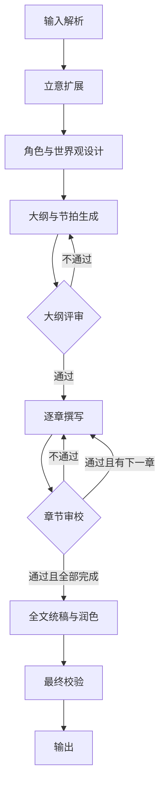

# 中短篇小说生成工作流设计

> 本文档描述的是[框架设计(framework-design.md)](framework-design.md)中定义的通用原语(Stage / Loop / ForEach / Checkpoint / State Store / Skill)在"小说生成"这一场景下的一个**具体实例**。流程结构、循环、状态存储都直接复用框架层,本文只负责场景特有的部分:拆出哪些 Stage、State Schema 长什么样、每个 Stage 需要挂载什么 Skill。若要迁移到其他场景(如报告撰写),应复用 framework-design.md 的结构,重写的是本文档这一层。

## 1. 目标与范围

**输入**

- 必填:题材/关键词(例如"废土世界里的最后一名邮差")
- 可选:字数区间(默认 8,000–20,000 字)、体裁(科幻/悬疑/言情/奇幻…)、叙事视角(第一/第三人称)、基调(轻松/沉重/黑色幽默…)、结构偏好(三幕式/起承转合/英雄之旅)

**输出**

- 标题
- 一句话简介 + 短简介(用于呈现,不进入正文)
- 完整正文,分章节
- (可选)字数统计、体裁标签

**设计目标**

1. 阶段化:把"写小说"拆成可独立验证的阶段,而不是一个大 prompt。
2. 状态先行:用显式的"故事圣经"状态存储人物、时间线、伏笔等事实,而不是依赖模型记住整篇上下文。
3. 早失败:在成本最低的大纲阶段做最严格的评审,减少成稿后的大改。
4. 可插拔循环:评审-修订是通用原语,可以复用到大纲、章节、全文三个层级。

## 2. 整体流程



## 3. 阶段详细设计

### 3.1 输入解析(Input Parsing)

- 校验/补全用户输入:题材必填,其余字段缺省时给出合理默认值(如未指定字数,按"中短篇"默认 8,000–20,000 字)。
- 输出一份结构化的 `StoryBrief`,作为后续所有阶段的共同输入起点。

### 3.2 立意扩展(Concept Expansion)

- 将题材扩展为:logline(一句话故事)、主题表达(这篇小说想说什么)、核心冲突(谁 vs 谁/什么,为什么无法回避)。
- 这一步不产出情节细节,只锁定"为什么值得写"和"冲突是什么",作为后续大纲的锚点,防止跑题。

### 3.3 角色与世界观设计(Character & World Bible)

- 设计主角、对手/阻力方、关键配角,每个角色包含:目标、动机、弱点、与主角的关系、在故事中的弧光(变化)。
- 若题材依赖设定(科幻/奇幻等),补充最小必要的世界观规则(只写会被情节用到的规则,避免过度设定)。
- 产出内容写入**故事圣经**的初始版本(见 [story-bible-schema.md](story-bible-schema.md))。

### 3.4 大纲与节拍生成(Outline & Beat Sheet)

- 依据选定的结构模板(默认三幕式,可切换起承转合/英雄之旅),生成章节列表。
- 每一章节包含:该章目标、发生的关键事件、结尾处的转折/钩子、涉及哪些角色与伏笔。
- 中短篇建议章节数控制在 6–15 章,单章 1,000–2,500 字,避免章节过碎或过长导致后续撰写阶段上下文压力过大。

### 3.5 大纲评审循环(Outline Critique Loop)

这是整个流程中**性价比最高的质检点**——此时改动成本最低。

- Critic 检查维度:是否呼应 3.2 的主题与核心冲突、节奏是否合理(前松后紧/中间垮掉)、是否存在逻辑硬伤、伏笔是否都有安排回收的章节。
- 不通过则带着具体修改意见回到 3.4 重新生成/局部修订大纲。
- 设置最大迭代次数(建议 3 次),超过则退出循环并保留最后一版 + 人工介入提示,避免死循环。

### 3.6 逐章撰写循环(Chapter Drafting Loop)

对每一章依次执行:

**输入**

- 该章的大纲节拍(3.4 产出)
- 故事圣经中与本章相关的切片(涉及的角色状态、地点、待用/待回收的伏笔——**只取相关子集,而非全部状态**)
- 上一章结尾摘要(保证章节间的衔接自然)
- 风格指南(视角、时态、语气)

**输出**

- 本章正文
- 本章摘要(供后续章节引用,替代"重新读全文")
- 故事圣经增量更新:本章新确立的事实、角色状态变化、新埋下或已回收的伏笔

> 为什么用"摘要 + 结构化状态"而不是把全文都塞进上下文:中短篇的总长度仍可能超出模型上下文窗口的舒适区,且全文平铺会稀释相关性。用摘要保证连贯性,用结构化状态(故事圣经)保证事实一致性,两者职责分开。

### 3.7 故事圣经/状态管理(Story Bible State)

贯穿 3.3–3.9 的共享状态,是保证长文本一致性的核心机制。详细字段设计见 [story-bible-schema.md](story-bible-schema.md)。

- 写入时机:角色设计阶段初始化,每章撰写后增量更新。
- 读取方式:按"本章相关"做切片读取,而不是每次读全量,控制上下文成本。

### 3.8 章节审校循环(Chapter Review & Revision Loop)

- Critic 检查维度:
  - **一致性**:是否与故事圣经中的既有事实矛盾(人物设定、时间线、已发生事件)
  - **人物**:言行是否符合角色设定与当前弧光阶段
  - **节奏与文笔**:是否拖沓/仓促,是否有明显的 AI 痕迹(套话、重复句式、空洞形容词堆砌)
- Revision agent 依据 critic 的具体反馈只重写被指出的片段,而非整章重写,控制成本。
- 退出条件:达到质量阈值,或达到最大迭代次数(建议 2–3 次);超限则保留当前版本并标记待人工复核。

### 3.9 全文统稿与润色(Manuscript Assembly & Polish)

- 拼接全部章节后做一次**全局性**润色,专门解决逐章审校无法发现的跨章问题:称呼/术语前后不一致、语气漂移、重复的意象或转折模式。
- 伏笔回收检查:遍历故事圣经中所有标记为"待回收"的伏笔,确认全文中都已处理;未处理的交由此阶段补写或明确判定为不再需要。

### 3.10 最终校验与输出(Final QA & Output)

- 校验:总字数是否在目标区间、章节结构是否完整、标题/简介是否已生成。
- 生成呈现用的元数据(标题、简介、体裁标签、字数)。
- 按 Markdown 输出完整正文(章节标题 + 正文),预留其他格式(纯文本/EPUB 等)的扩展点。

## 4. 用框架原语拼出这套流程

按 framework-design.md §7/§8 的组装方式,本场景的 Workflow 定义大致是:

```yaml
workflow: novel_generation
state_schema: story-bible-schema.md

stages:
  - sequence: [input_parsing, concept_expansion, character_world_design]

  - loop:                      # 3.4 + 3.5
      producer: outline_generation
      critic: outline_critic
      reviser: outline_generation
      max_iterations: 3
      on_exceed: escalate_to_checkpoint

  - checkpoint: confirm_outline   # 见 §5

  - foreach:                   # 3.6 + 3.8,对每一章
      items_path: story_bible.chapters
      body:
        loop:
          producer: chapter_drafting
          critic: chapter_critic
          reviser: chapter_revision
          max_iterations: 3
          on_exceed: escalate_to_checkpoint

  - sequence: [manuscript_assembly_polish, final_qa]
```

每个 Stage 需要在其 Agent 上挂载对应 Skill 才能完成具体工作;流程结构本身(sequence/loop/foreach 的嵌套)不因场景而变:

| Stage | 对应文档章节 | 框架原语 | 需要开发的 Skill(示例) |
|---|---|---|---|
| input_parsing | 3.1 | Sequence | `input_parsing_skill` |
| concept_expansion | 3.2 | Sequence | `concept_skill` |
| character_world_design | 3.3 | Sequence | `character_design_skill`(含写入故事圣经的工具) |
| outline_generation / outline_critic | 3.4 / 3.5 | Loop | `outline_skill`、`outline_critique_skill` |
| chapter_drafting / chapter_critic / chapter_revision | 3.6 / 3.8 | ForEach(Loop) | `chapter_writing_skill`、`consistency_check_skill`(读故事圣经做矛盾检测)、`prose_revision_skill` |
| manuscript_assembly_polish | 3.9 | Sequence | `global_polish_skill`、`foreshadowing_audit_skill` |
| final_qa | 3.10 | Sequence | `qa_skill` |

"让它更专业地生产小说"在这套结构下,主要工作量落在打磨 `chapter_writing_skill`(文笔、节奏控制)和 `outline_critique_skill`/`chapter_critic` 的评判标准上——不需要改动上面这份 Workflow 定义的骨架。

## 5. Checkpoint 配置(可选,建议)

- **`confirm_outline`**(强烈建议保留):大纲评审通过后,给用户一次确认/调整机会,这是全流程中改动成本最低的节点。
- **阶段性审阅**(可选):每完成若干章节或全文完成后插入一个 Checkpoint,允许用户提出修改意见并触发对应 `foreach` 项的重新执行。

## 6. 开放问题 / 后续迭代方向

- 更长篇幅(长篇/多卷)的分层大纲设计,当前设计假设总长度在"中短篇"范围内。
- 章节撰写的并行化可能性(哪些章节可以并行生成而不破坏一致性)。
- 生成质量的自动化评估指标(而不仅依赖 critic agent 的主观判断)。
- 多风格/多语言支持。
