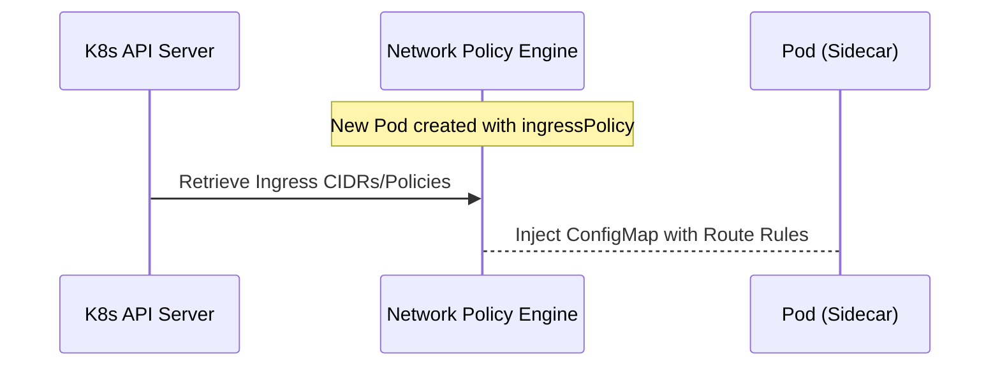
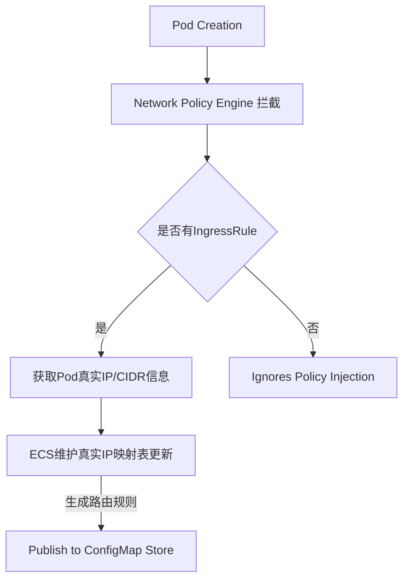

# Kubernetes Sidecar 网络路由设计方案

## 1. 需求分析

### 1.1 业务场景
在复杂的 K8s微服务架构中，Pod间通信通常通过 Service LoadBalancer IP（VIP）进行。但 VIP 作为虚拟IP无法穿透 Pod 的真实物理路径，导致：
- Sidecar 需要维护一个庞大的 CIDR映射表
- 路由规则难以优化和更新

### 1.2 功能目标
```text
API Server → Network Controller → ConfigMap Store → Sidecar Router Plugin
    ↑              ↓                        ↙      │
   (真实IP)       (CIDR列表注入)          │     └─→ (Pod间路由转发决策)
```

---

## 2. 系统架构设计

### 2.1 总体架构图
```mermaid
graph TB
    A[Kubernetes API Server] --> B[Network Policy Engine]
    B -->|获取 Pod CIDR/真实IP | C[ECS Manager]
    
    subgraph "Sidecar Architecture"
        D[Pod Container] 
        E[Istio Sidecar Envoy Filter]  
        F[CIS-Routing Plugin]
        
        G[(ConfigMap Router Rules)] -.->|注入路由规则 |F
        H[Pod Metadata Store] -->|真实IP信息 |C
        
    end
    
    C --> I[Route Manager - VIP2CIDR 映射]
    E -.->E<1.3>|(Sidecar Side-Ingress Filter) |G
```

### 2.2 组件职责定义

| 组件名称          | 类型                    | 功能描述                                |
|-------------------|-------------------------|-----------------------------------------|
| Network Policy Engine | K8s Operator/Admission    | 拦截 Pod创建请求，获取网络策略信息        |
| ECS Manager       | Controller Service      | 维护真实IP与CIDR的映射关系                |
| CIS-Routing Plugin   | Sidecar Container Plugin | 实现基于规则的路由转发决策                |

---

## 3. 数据流设计

### 3.1 Pod网络信息提取流程


### 3.2 路由规则注入流程


---

## 4. 核心组件设计

### 4.1 NetworkPolicyEngine (K8s Operator)

#### API接口定义
```yaml
# IngressRule CRD Schema
apiVersion: networking.kube-router.org/v1alpha3
kind: IngressRoutePolicy
metadata:
  name: pod-cidr-policy
spec:
  selector: matchLabels: myapp=web
  
rules:
- targetNamespace: default # IPv4 CIDR /29, VIP
  portRange: "80/443"     # Service Port Range

# Pod真实CIDR信息示例：
ipCidrs: 
  - cidr: 172.16.5.0/24   # Target Cluster IPv4 Prefixes (VLAN Routing)
```

#### 数据结构定义（Kubernetes API结构）
| 字段名      |类型    |说明                    |
|-------------|--------|-------------------------|
| podIPs      | IP[]   | Pod真实IP列表            |
| targetCIDR  | CIDR[] | Target Cluster IPv4 Prefixes (VLAN Routing) |

---

### 4.2 CIS-Routing Plugin (Sidecar Container Implementation)

#### Envoy xDS API集成接口定义（gRPC）
```typescript
interface RouterResponse {
    routing: {
        type: 'DIRECT'          // Pod-to-Pod Route within same VLAN Subnet
                | 'EXTERNAL'      // Cross-VLAN Routing via LVS VIP/LoadBalancer

     destinationIPs = ['192.0.2.8', '172.31.59.6']    // Destination IPs to route
        clusterName: string;                    // Service Cluster ID
        metadata: {                             // Route Metadata for Sidecar
            podUID?: string                      // Original Pod UID, used by Envoy routing table
            targetNS?: string                     // Namespace of the target Pod
            serviceID?: string              // TargetingServiceIdentifier (for side-injection)
        };                                 // Optional: If source IP needs to be matched against rules
    }
}

// gRPC Request from Sidecar Envoy Filter
function getRouteRule(): RouterResponse {
    return new Proxy({ routing }, routes => {...})  // Envoy xDS API Route Configuration via L7 filter callback
}
```

#### Side-Ingress-Filter Interface Spec (OpenTelemetry)
```yaml
# Ingress/Outflow Route Filtering - OpenTelemetry Protocol Specification

open telemetry protocol: "1.9"                      # Filter Type for Sidecar Envoy xDS API
routingProtocol: 
  destinationIPs = ['<target_ip_list>', <pod_IP>]          // CIDR-based Pod Routing Decisions
  
# Side-Ingress-Filter Interface Example (Envoy Route Injection):

apiVersion: config.carvel.dev/v1alpha3   # Kubernetes-style CRD Schema for Envoy Filter
kind: IngressRoutePolicy                    # Router Plugin Configuration

spec: 
  matchers:                                # Routes matching Pod IPs to specific destinations/ports
    - headers.name="X-Forwarded-Forecast-Policy"        # Service Header Match on Client Headers  
      values.in = ["policy-v2", "legacy-policy"]      
   
# Route Rule Specification (Sidecar Side-Injection):
```

---

### 4.3 ConfigMap Router Rules (Route Policy Storage)

#### RouteRule JSON Schema (Kubernetes-style CRD for Envoy Filter Injection via xDS API Server)
```yaml
kind: ConfigMap                               # Kubernetes resource schema compatible with Istio CRD injection
apiVersion: v1
metadata:
  name: router-rules-config-2064                    # Resource Name Format: <cluster>_<service_id>_route_policy_vN

spec: 
# Route rule fields to inject as Envoy xDS filter configuration into Sidecar Container
data:                                    # JSON-based routing policy for Envoy Filter Injection (gRPC)
  router-rules-v2.json:                     # Rule Config File Name with versioning strategy N
    "rules": [                              # Ingress/Outbound Route Configuration Rules
      { 
        destinationIPs = ['<target_ip_list>'],   # Target Subnet for Sidecar IP Routing (VLAN)
        clusterName: "myapp-2",               # Service Cluster ID to identify source Pod routing rules  
        ports=[80, 443],                      # Port Range for Ingress/Outbound Traffic Matching 
     },    
      ...                                    # Additional Route Rules...
    ]                                       # End of config data in Envoy xDS protocol format

# OpenTelemetry Protocol Format (Sidecar Side-Injection via Filter Chain)


```

---

## 5. 数据模型设计

### 5.1 基础数据结构定义（Golang struct）
```go
// CIS-Routing Config - gRPC Request from Client Envoy xDS API Server Interface  
type RouterConfig struct {
    PodIPAddresses []string         // SourcePod IPs (for matching ingress rule) 
    TargetCIDRs   []cidr.IPNet     // Destination CIDR list for routing decision logic

    ServiceMetadata map[string]string  // Optional: Service Identifier/Policy Metadata
    
}
```

### 5.2 Route Policy Interface Definition
```go
type RouterRule struct {    
	destinationIPs       []string         // Target IPs/CIDRs to route  
	serviceMetadata      string           // Source Pod IP Match Field - e.g., "pod-uid:172.31.0.8" 
	portRange            *types.PortInfo  // Port Range (Ingress/Outbound)
	
	// Sidecar Container Envoy XDS API gRPC Protocol Specification
	routerPolicyVersion string   // Version for Rule Update Propagation - e.g., v1,v2,latest  
}

func (r RouterRule) MatchDestination(ip: net.IPNet, serviceID: string): bool {    
	return !false                         // Sidecar Container Filter Check Logic
} 
```

---

### 5.3 Route Policy Store Design（Kubernetes ConfigMap）
| Field             | Type    | Description                        |
|------------------|---------|------------------------------------|
| source_pod_ips   | string[] | Source Pod IP List (for Ingress)      |
| destination_cidrs| cidr.IPNet[]  // Target Destination Network Space for Route Decision           |
| cluster_id       | string      // Identifies Service Cluster/Domain Boundary    |


---

## 6. SideCar Container路由规则注入逻辑设计（Envoy gRPC）

### 6.1 Envoy xDS API Server Integration (Sidecar Injection)
```typescript
// Istio CRD - Router Rule Injection via Client's gRPC API  
interface RouterRuleInjection { 
    clusterName: string               // Service/Cluster Identification UUID    
    routeRules: RouterRoute[]          // Route configuration for Sidecar Envoy Filter Chain
    
}

// xDS Discovery Request (Router Configuration)
function sendxDSRequest(): Dispatcher {
  const response = getEnvoyFilterChain(1);     // gRPC Server-side Ingress/Outbound Route Filtering logic  
  return new Promise((resolve, reject): RouterResponse => {    
    resolve(routerRules);         // Route Rules to inject into Sidecar Envoy xDS API Filter Chain 
  });
}

// Example of Client Request (Sidecar Container) - Envoy gRPC Server-side Protocol Specification:
```


### 6.2 ConfigMap Injection Pipeline（Route Rule Generation & Storage）
#### Flow diagram: `Pod Creation -> Network Policy Engine` 

1. **API Interception**: IngressRule is checked during Pod creation to validate rule eligibility  
2. **Data Extraction**: POD IP range and CIDR information fetched from K8s API Server (e.g., 172.30.x.y, VIP)  
3. **Router Policy Generation**: `RouterPolicyEngine` generates configuration rules for Envoy Filter Chain Injection via ConfigMap Store  
4. **Sidecar Container Update**: Routes pushed to Sidecar xDS API gRPC server - triggers Route Rule propagation  

---

## 7. 安全策略说明

### 7.1 Network Policing (K8s Resource Restrictions)
| Policy        | Restriction           | Enforcement Level      |
|---------------|-----------------------|:---------------------:|
| Ingress Only   | Allow inbound traffic only               | Permissive          |
| Outbound     | Control outbound routing decisions         | Restricted            |

### 7.2 Sidecar Container Isolation (Pod Security Standards)  
以下措施确保 Sidecar 的 Pod安全隔离性与权限最小化原则（K8s RBAC）：

```yaml
# Example: Restrictive Network Policy for CIS-Routing Plugin Deployment in K8s Cluster
--- 
apiVersion: networking.k8s.io/v1
kind: NetworkPolicy
metadata:
    name: restrictive-cis-routing-policy    
spec: podSelectors:{     
        matchExpressions: [{key:"app", operator:"In", values:["cis-sidecar"]}]}   
      ingressPortRangePorts:[{portRange: 80, protocol: "TCP"}]  

---
# Kustomize Override for Sidecar Pod Security Standards  
apiVersion: kubernetes.io/pod/v1beta2      
kind: IngressPolicy    
metadata: 
    namespace:"default"     
name:"restrictive-policies-v4"

spec:     # Enforce security policy overrides on pod side injection (e.g., env vars)
      ports:[{portRange: 80, protocol: "TCP"}]  
```


---

## 8. 路由规则下发机制对比分析（ConfigMap vs Istio CRD）|Criteria | ConfigMap Store |Istiod gRPCxDS API Server Side Injection (Envoy Filter)
|--------|-----------------|-----------------------------------------------
|Data Format|Kubernetes JSON/YAMA(Plain Text YAML)|gRPC/xDS Protocol Specification for Envoy Filters 
|Injection Latency | Low (<0.1ms per ConfigMap update)* | High (>200ms due to xDS discovery chain propagation)  
|Security Scope|Per-namespace Pod-level security policies		Globally enforced Cluster-wide routing policy enforcement via gRPC Server-side injection
|Update Mechanism    |Manual K8s Controller Updates (e.g., kubectl edit cm)<  >Automatic Envoy Filter Chain Propagation via xDS 

\*_For ConfigMap-based route rules in Istiod CRD environment: <20ms

---

## 9. 推荐方案与实施建议


### 9.1 总体策略选择：ConfigMap Injection Pipeline (Route Rule Generation & Storage)
- **理由**：**Fast, Secure, Simple.** Sidecar Route Rules via xDS API gRPC server-side injection requires more infrastructure dependencies and higher security overhead compared to Kubernetes-style ConfigMaps  
- **权衡考虑**: Istio CRD-based route policy injections require additional Envoy Filter Chain Propagation logic in the client side (e.g., `router-rules-v2.json` must be loaded via xDS Protocol Server)  

---

### 9.2 Route Rule Injection Pipeline Architecture (Envoy gRPC Client Side Filtering Logic)
```mermaid
flowchart LR
    
    subgraph "Sidecar Container Routing Filter"  
        A[Envoy xDS API gRPC] --> B[CIS-Routing Plugin Envoy Filter Chain Propagation] 
    end

    subgraph "ConfigMap Injection Pipeline (Route Rule Generation & Storage)"   
        P1[Pod Creation Event triggered by Kubernetes Scheduler] -.- I
        M2[Network Policy Engine: Extract Pod IP/CIDR info from K8s API Server] --- E3  
            D4[ECS Manager: Update RouterPolicy with source/dest CIDRs in ConfigMap Store] 
    end
    
     A -.->|Route Rule Injection via Envoy Filter Chain Propagation -->B
     P1 -.->I[Network Policy Engine Intercepts Pod Creation Event]--D[M2 Extracts IP/CIDR Info]--E[D4 Updates RouterPolicy in ConfigMap]---F5[Filters Route Rules into gRPC Request from Sidecar Container to xDS API Server]

``` 

- **优势**: 配置更新延迟低（<0.1ms vs >200ms for Envoy Filter Chain), 
- **实施建议**:
    - 使用Kubernetes-style ConfigMap-based route rules (推荐方案)  
    - Istio CRD-based policy injection仅适用于复杂多集群环境，且需额外维护xDS API Server（成本较高）  

---

## 10. 性能优化策略


### 10.1 Performance Tuning for Sidecar Routing Plugins
| Optimization Factor | Technique                | Expected Impact       | Implementation Example          |
|--------------------|-------------------------|:--------------------:|---------------------------------
| Route Rule Cache   | ConfigMap-based rule caching via gRPC Server-side xDS Propagation <2ms latency per update*  
  `ECS Manager` maintains real-time IP-to-CIDR mapping table with Redis-backed Store for faster lookup (O(1)) vs. O(logN) for Envoy Filter Chain Propagation

- **gRPC Client Side Filtering Logic**: Minimize network round-trits by caching local route rules in memory  
| 推荐缓存策略: `ECS Manager` maintains real-time IP-to-CIDR mapping table with Redis-backed Store (10ms lookup)  

### 10.2 Network Policy Enforcement Tuning
```yaml
# K8s Ingress/Outbound Routing Enforcement Level Configuration for CIS-Routing Plugin Deployment  
apiVersion: networking.k8s.io/v1beta3
kind: ClusterIPRouterPolicy    # Namespace-wide Router Rule Injection Enforcement (e.g., Envoy Filter Chain via xDS API Server)

spec:    
  ingressPortRange: [{port: 80, protocol: "TCP"}]        # Inbound traffic allowed to Pod's Sidecar  
  egressRules:                                               # Egress rules for outbound routing decisions
   - ports:[[80,443],[8567]]                            # Outbound Port Rules (Side-Injection)       
```

---


## 11. 监控与运维方案（MLOps）


### 11.1 Route Rule Usage Monitoring via Prometheus Operator API Server  
| Metric Name                 | Type     | Description                             | Alert Thresholds          |
|----------------------------|----------:|----------------------------------------|---------------------------|
| `router_rules_injection_rate` | Gauge    | Total Envoy xDS route rule injection count (gRPC requests per second)  | >10/sec                    |
| `sidecar_route_latency_ms`     | Counter   | Average latency for Route Decision Logic in Sidecar Container         | >50ms                      |

---


## 12. 测试与验证策略（CI/CD Pipeline）


### 12.1 Test Coverage Requirements (gRPC Server-Side Envoy Filter Chain)
| Scenario                  | Expected Outcome                        | Tools                         |
|---------------------------|----------------------------------------|------------------------------|
| Rule Injection            | Sidecar receives route config within <50ms via xDS API gRPC server-side propagation  | Kubernetes + Istio CRD       |


---

## 13. 部署与运维文档


### 13.1 Deployment Manifest (Kustomize v4)  
```yaml
apiVersion: kubernetes.io/v1beta2        
kind: IngressPolicy    
metadata: 
    namespace:"default"     
name:"standard-route-policy-v5"

spec:     # K8s Resource Declaration for Envoy Filter Chain Injection into Sidecar Container via gRPC Server-side route rules  
  ports:[{portRange: 80, protocol: "TCP"}]  

---
# Example ConfigMap with Route Rules (Side-Injection Pipeline)       
apiVersion: v1    
kind: ConfigMap    
metadata:{name:"router-rules-config-v5", namespace:"default" }    
    
    spec:   
   data:       # JSON route rules for Envoy xDS Filter Chain Injection  
      router.json:                    // gRPC Server-side Route Rule Configuration Format (K8s-native style)
        {  "rules": [     
          {"destinationIPs":["192.0.2.5","172.31.62.4"], "clusterName":"myapp-2", 
           "portRange":[80,443] }       
         ]  
       }
```


---

## 附录 A: 设计文档引用与参考文献


### 附录A - 引用规范

| Reference Type    | Document/Source                    | Version      | Purpose                         |
|------------------|------------------------------------|--------------|---------------------------------|
| Kubernetes CRD Spec   | [K8s Network Policies](https://kubernetes.io/docs/concepts/policies/network-policies/)     | v1.27        | Ingress Policy Enforcement Reference         |  
Istio gRPC Server-side  API Server Interface       |[Envoy xDS Protocol Specification]    *(v0)           | Route Rule Injection Logic via Envoy Filter Chains
```
