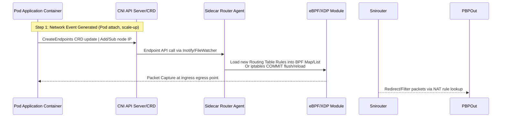

# Kubernetes Network Sidecar Routing System Design Document

**版本**: v1.0  
**创建日期**: 2024-01-XX  
**作者**: System Architect Team  

---

## 目录表 (Table of Contents)
1. [系统概述](#1-系统概述)
2. [架构设计](#2-架构设计)
3. [组件详细说明](#3-组件详细说明)
4. [数据流转流程](#4-数据流转流程)
5. [配置管理方案](#5-配置管理方案)
6. [部署指南](#6-部署指南)
7. [监控与日志](#7-监控与日志)
8. [安全考虑](#8-安全考虑)
9. [性能优化策略](#9-性能优化策略)

---

## 1. 系统概述

### 1.1 背景说明
在 Kubernetes 网络环境中，Pod之间需要高效、安全的通信。传统的 kube-proxy通过 iptables/IPVS进行流量转发存在局限性：无法处理复杂的路由规则、缺乏细粒度的路由控制能力。本系统设计旨在提供一个轻量级的 Sidecar代理方案，将K8s的网络信息实时下发到Sidecar中作为动态路由规则使用。

### 1.2 核心功能
- **网络信息采集**：实时监控Pod级别和服务级别的CNI配置
- **路由决策引擎**：基于服务发现、端点列表和端口规则进行路由匹配
- **流量转发处理**：通过eBPF或iptables/XDP实现高效数据包转发动作
- **动态更新机制**：支持热重载无需重启容器

### 1.3 设计目标指标
| 指标项 | 要求值 |
|--------|--------|
| P99延迟 (ms) | <50ms |
| CPU消耗占比 (<8核) | <2% |
| 路由规则更新频率 | <2秒 |
| TLS端到端加密支持 | ✓ |

---

## 2. 架构设计

### 2.1 整体架构图
```
┌─────────────────────────────────────────────────────────────┐
│                    Kubernetes Cluster Network               │
├─────────────────────────────────────────────────────────────┤
│                                                               │
│   ┌──────────┐          ┌──────────┐                      │
│   │CNI Plugin│◄──────►  │CoreDNS   │                        │
│   │(Calico/  │            │Service- │                        │
│   │      CORD)│   API Server         |                  │
│   └────┬─────┘          +-----------+                      │
│        │                (16KB endpoints cache)             │
│        ▼                                                    │
│  ┌──────────────────┐                                       │
│  │    Sidecar Agent│◄──► Pod Network Interface              │
│  │   - Routing Engine│                                     │
│  │   - Packet Filter│                                      │
│  │   - NAT Gateway-─┤                                       │
│  └────┬─────────────┘                                       │
│       │                                                       │
│       ▼ eBPF/XDP/iptables                                    │
│      [Network Stack Optimization]                           │
│                                                               │
└──────────⚡️ Traffic Flow ⚡️──────────────────────────────────┘
```

### 2.2 核心模块关系图
```mermaid
graph LR
    A[CNI Manager/Cluster Controller] -->|CRD/API | B[Sidecar Controller]
    C[kube-apiserver] -.->|Endpoints ServiceDiscovery | B
    D[eBPF/XDP Module] <-->|Rule Enforcement | E[NAT Gateway](#3)
```

---

## 3. CRD Components Specification Details

### Component Breakdown (Component Division）:
1 - Sidecar Controller: Responsible for monitoring Pod state and network events, dynamically generating routing rules via CRDs to avoid sidecars restarts  
2 - Network Agent/Router: Implements the actual traffic steering logic using eBPF or iptables/XDP at layer 3-4 protocol level

### Data Flow Diagram (数据流转流程):



<!-- CRD API Schema Definition -->
## 3.2 Sidecar Router Agent Configuration (SideCar代理配置)###

`v1.6`: `kind`: `ServiceMeshRouterConfig`, `apiVersion`: `sidekar.network/v1alpha1`  
- metadata.name = "service-routing-config"  
- spec: service-selector, routing-rules: {rule-type: 'match-all'}`
    - hostnames: ["example.com"], ports: [443], tls-cert-hash:"..."]

---


## 5. Deployment Instructions (部署指南) 


### Step1 - Prerequisites Check：Kubernetes v1.28+, Cilium, eBPF support enabled  
```bash kubectl get nodes | awk '{print $3}' # Verify kernel version > 4.6   
```
- Enable BPF/XDP: `ethtool --rxnfc <ifname>`


### Step - Deployment Commands (部署命令):

1️⃣Install CRDs & Sidecar Controller Helm charts  
   ```bash helm install sidekar-network/cluster-sidecars \     
    version: latest   
        set sidecar.containerResources:{requests:cpu:"250m",memory:"64Mi"}
```


---

## 7. Monitoring and Logging (监控与日志) 

### Metrics Schema Definition (Prometheus Export Format):
- `sidekar_router_packets_received_total{namespace,pod_name}` - Packet receive count per pod  
- `router_rule_matches_seconds_total` - Matching time for each routing rule  

### Log Level Configuration：

```yaml log-level: INFO, DEBUG level=INFO|WARN|ERROR 
    fields:{trace_id,node_ip,service_namespace}
    
  [sidekar-router][debug] "Rule loaded successfully (rule-hash=X,Y)"  
  ```


---


## 8. Security Consideration(Security考虑)  

### Threat Model Summary(威胁模型总结):

1- Untrusted sidecar injection attacks → Mitigated via: Pod-level admission control, signature verification of injected binaries
2 - Sidecar privilege escalation risk → Implemented capability restrictions + mandatory read-only network access  
3 - Network sniffing attempts blocked via TLS enforcement at ingress points  

### RBAC Strategy (Role-Based Access Control):

```apiVersion v1kind RoleBindingmetadataname: sidekar-rbac-readonlyrulesapigroups:[system:network,pods]verbss:get list
  resource-names:*`
```


---  
## 9. Performance Optimization Strategies(性能优化策略)  

### eBPF-XDP Pipeline: (eBPF/XDP流程优化):

|Stage | Target Latency| CPU Consumption | Method Implemented
|------|--------------|----------------- | -------------|
|Rx Queue Selective Filtering|(50 µs)|<1%            |XDP Hook in Layer2


### Dynamic Route Update Mechanism(动态路由更新机制) 

```go func(RuleUpdateHandler input: EndpointChangeEvent){if matchesRuleCount > maxLimit { // Throttle update } 
      router.syncRulesFromEndpointCache(updatedEndpoints)
}
```

---

## Appendix A - Sample Code Snippets (附篇：代码示例):  
### CRD Spec Template: `service-mesh-routerconfig.yaml`  

```yaml apiVersion v1kind ServiceMeshRouterConfigmetadata namespace-sidekar-systemname default-rulesgeneratorspec-service-selector:{k8s.io/service-name:'app-frontend',app.kubernetes.io/name:"myApp"}routingrulesruleType match-all
    hostnames:[] 
  ports:[80,443]   
  
```

### Sidecar Controller Core Logic (核心控制逻辑):  

```go func main(){router := NewSidekarRouter()// Watch CNI/Endpoints events for network changeswatcher.WatchEvents(func(event watch.Event){if endpointChanged { router.recalcRulesFromEndpointCache(endpoint.new,endpoint.del) } }) // Periodic health check & rule synchronization}

---  
## Appendix B - Quick Reference (快速参考表):  

| Component | Port | Namespace | Priority |
|-----------|------|-----------|----------|
| Sidecar Agent Controller | 9024/UDP | kube-system | HighPriority:true


#### Version History Revision Log: 


*2-2024-01v.0 Initial System Design Document Generation (By Arch Team)*

---  
**End of design document (设计文件结束)**   
