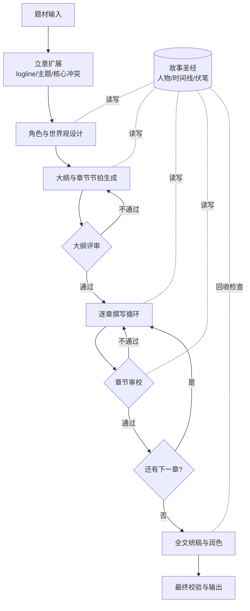

# scenarios/ —— 场景层(二次开发挂载点)

这里存放**基于框架层构建的具体场景**。框架层(engine / agent / state / llm / tools)
不放任何场景语义;所有"小说""报告"之类的内容都落在这个目录下的子包里。

目前有两个场景,它们的差别正好演示了"场景语义可以放在哪一层":

| 场景 | 产出 | 题材 | 人工介入 |
|---|---|---|---|
| [`novel/`](novel/) | 中短篇小说(6-15 章) | **写死在流程 prompt 里**(现代人穿越西汉、随张骞出使西域) | 大纲与每章都有人工确认断点 |
| [`short/`](short/) | 短篇网络小说(8000-10000 字,追求爽点) | **与流程无关**:用户填 [`short/brief.yaml`](short/brief.yaml),流程 prompt 一个字都不改 | 无,全自动;正文不重写,只做一次语言校对,守住"没有语病/错别字/AI 腔"这条线 |

`short/` 是"内容与流程分离"的参考实现:用户 prompt(写什么)与流程 prompt(怎么写)
分处两个文件、只经 State 相接,细节见 [scenarios/short/README.md](short/README.md)。

## 示例场景一:小说生成

**根据用户给定的题材,自动生成一篇中短篇小说**——这是目前用来验证框架抽象是否好用的第一个具体场景。要让它"更专业地生产小说",预期的改动方式是打磨/扩充对应 Stage 上挂载的 ToolSet(如章节撰写、一致性评审),而不是改动引擎结构。

### 为什么需要拆阶段,而不是一次性生成

直接让模型"根据题材写一篇小说"通常会遇到:大纲阶段的问题被带入全文导致返工代价极高、章节之间人物/设定前后矛盾、长文本超出上下文窗口后细节丢失、文笔和节奏难以自动把控。因此工作流按阶段拆解,并引入显式的状态存储与评审循环来约束质量。

### 工作流概览

图中的 `{大纲评审}`/`{章节审校}` 是同一个 Loop 原语的两次实例化,`故事圣经` 是 State Store 的一个场景实例——细节见 [docs/workflow-design.md](../docs/workflow-design.md) 与 [docs/story-bible-schema.md](../docs/story-bible-schema.md)。

## 一个场景通常包含什么

参照 [docs/framework-design.md](../docs/framework-design.md) §8 的二次开发步骤,一个场景子包(如 `scenarios/novel/`)一般包含:

| 文件/模块 | 职责 | 对应框架构件 |
|---|---|---|
| `state_schema.yaml` | 定义该场景的共享状态结构 | `state.StateSchema`(小说见 [docs/story-bible-schema.md](../docs/story-bible-schema.md)) |
| `schemas/*.yaml` | 各 Stage 的输出契约(可借用 state_schema 里的具名类型) | `state.StateSchema` |
| `toolsets/` | 每个 Stage 需要的工具集(**主要开发工作量**) | `agent.ToolSet` |
| `prompts/*.prompt` | 每个 Agent 的提示词;共享片段用 `@名字` 引用 | `prompts.PromptRegistry` |
| `stages.yaml` | 声明每个节点:executor / reads / writes / schema / tools / prompt | `engine.spec.build_node_registry` |
| `workflow.yaml` | 用 Sequence/Loop/ForEach/Checkpoint 拼出流程 | `engine.Workflow.from_spec` + `engine.primitives` |
| `stages.py` | 只剩纯函数 executor(`@executor` 登记)与声明式表达不了的节点包装 | `engine.stage.ExecutorRegistry` |
| `run.py` | 组装 LLMClient / StateStore / RunContext 并运行 | 入口 |

## 从框架到场景的映射(以小说为例)

- 流程结构见 [docs/workflow-design.md](../docs/workflow-design.md) §4 的 Workflow 定义。
- 大纲评审、章节审校 = 同一个 `Loop` 原语的两次实例化。
- 逐章撰写 = `ForEach(chapters, body=Loop(body=[draft, critic, human_gate]))`。
- 故事圣经 = `StateSchema` 的一个实例。

## 关键点

**专业化一个场景 = 打磨 `toolsets/` 与 `prompts/` + 调整 `state_schema.yaml`,而不是改动框架层。**
新增场景时,复制这套目录约定,替换成你自己的 State Schema 与 ToolSet 即可。
