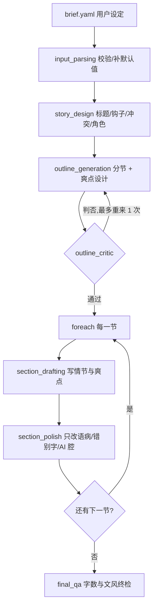

# scenarios/short —— 短篇网络小说(8000-10000 字)

一条**内容无关**的流水线:给它一份用户设定(写什么),它产出一篇追求爽点的短篇网文,
全程无人工审核。质量要求是硬性的 —— 不能有语病、不能有错别字、不能有明显的 AI 痕迹
(频繁短句、大量单句成段、描写零散)。

## 两份 prompt 是分开的

这是本场景最重要的一条约定:

| | 说什么 | 在哪 | 谁改 |
|---|---|---|---|
| **用户 prompt** | 写什么:题材、主角、对手、爽点类型、结局、禁忌…… | [brief.yaml](brief.yaml),字段由 [brief.py](brief.py) 定义与校验 | 用户,每篇都改 |
| **流程 prompt** | 怎么写:爽点结构、语言底线、各节点职责 | [prompts.py](prompts.py) | 开发者,换题材时**一个字都不改** |

两者只通过 State 相接:`brief.yaml` → `brief.parse_brief` → `short_story.brief` → 各 Stage 的
`reads` 注入。流程 prompt 里不出现任何具体人名/时代/世界观,
[tests/scenarios/short/test_pipeline.py](../../tests/scenarios/short/test_pipeline.py) 里有一条测试专门守着这件事。

`prompts.TROPE_BANK` 是这条边界唯一的例外,且是刻意的:它是一份"起步词库"
(常见主分类 + 设定/反差组合),只在用户的 genre/protagonist/antagonist/hook_types
留空时给 `story_design` 一个参考起点,用户写明的部分它让位。取材于内容平台公开的
作者激励公告中反复验证过、稳定有阅读吸引力的方向,不是凭空拍的,但也只是起点——
选定方向后仍要落到具体独特的人物与冲突。

对照组是 `scenarios/novel`:那份场景把"西汉、张骞"焊死在了 `stages._STYLE_GUIDE` 里,
只服务一个题材。

## 用法

```bash
# 1. 看看能填哪些设定
python -m scenarios.short.run --show-fields

# 2. 改 scenarios/short/brief.yaml(只有 premise 必填,其余留空 = 由模型决定)

# 3. 跑
export OPENAI_API_KEY=sk-...
export SHORT_MODEL=qwen3.7-max
export OPENAI_API_BASE_URL=https://.../compatible-mode/v1
python -m scenarios.short.run --output-dir scenarios/short/output --log-chats
```

产物落在 `--output-dir`:`story.md`(成品)、`outline.md`(大纲/角色/爽点设计)、
`qa_report.json`(终检报告)、`state.json`(完整状态)。

中途失败会保存续跑点,重跑同一条命令即可接着走;**想重新生成一篇新的,加 `--fresh`**
——否则它会认为你在续跑一份已经完成的状态,什么都不做。

## 流程



没有 Checkpoint,唯一的 Loop 在大纲那一层(`on_exceed: accept_last_version` —— 没有人在等着
裁决时,升级人工只会把流程卡死)。

**正文层不留重写的余地**:一节固定两次调用 —— 撰写一次、校对一次。校对(`section_polish`)
只改语言,不碰情节、不调段落顺序,所以返工代价是固定的,不会把这一节的爆点重新赌一遍。
一篇 4 节的稿子总共约 **11 次调用**(1 骨架 + 1~2 大纲 + 1 大纲评审 + 4 撰写 + 4 校对)。

想拿时间换质量时,把 `workflow.yaml` 里注释掉的那段审校循环换上来即可 —— `section_critic`
节点一直在 `stages.py` 里登记着,它会让每节最多多跑一轮完整重写。

## 质量守在哪条线上

这条流水线不追求产品级质量,只保三件事:剧情与爆点立得住、没有语病和错别字、没有明显
AI 腔。分工是:

1. **确定性体检**([toolsets/style.py](toolsets/style.py)、[toolsets/structure.py](toolsets/structure.py))
   —— 能算的绝不交给模型判断:
   - 短句占比 / 单句成段占比 / 长句占比 / 套话密度(对应点名的三类 AI 痕迹)
   - 本节字数与预算的偏差、全篇总字数
   - 大纲的编号连续性、字数预算合计、爽点"先埋后放"的先后关系

   大纲层算出的问题**一票否决**(`stages._merge_verdict`),模型说通过也没用;正文层算出
   的问题变成校对节点的整改清单。阈值集中在 `style.DEFAULT_THRESHOLDS`,要松紧只改那一处。

2. **一次校对**(`section_polish`)—— 语病、错别字、成语量词误用、标点、称呼不一致这些
   程序看不见的硬伤,靠每节固定一次的校对扫掉。它被明确限制成"校对而非作者":没毛病
   的句子原样保留,每一处改动都要对应到清单上的某一条。

3. **终检如实交代**(`final_qa` → `qa_report.json`,并附在 `story.md` 末尾)—— 没有人工
   复核,成色就得写在明面上:总字数是否达标、哪几节的文风体检还有越界项。

## 与 novel 场景的其他差别

- **模型只产出它真正创作的那部分**:撰写节点只返回本节 `text`/`summary`,整份 sections
  数组由 executor 拼好再交给声明式 `writes` 写回。novel 那边要求模型原样回显整个数组,
  代价不只是 token —— 让模型抄一遍前面几章的正文,本身就是丢字、改字、串味的主要来源。
- **每次调用都清空对话记忆**(`stages._ask`):同一个 Agent 实例会被每一节复用,
  不清空的话模型会顺着自己上一节的句式继续写,那正是要防的 AI 痕迹。跨节连贯性走
  State(前情摘要 + 上一节结尾原文),不靠对话历史。
- **不写"只输出 JSON"这类叮嘱**:每个 LLM 节点都带 `output_schema` 走 Provider 的结构化
  输出,字段与类型由协议保证。

## 目录

| 文件 | 职责 |
|---|---|
| `brief.yaml` / `brief.py` | 用户设定:模板与字段契约(必填项、默认值、校验) |
| `prompts.py` | 流程 prompt(内容无关) |
| `state_schema.py` | 共享状态:`brief`(用户填) + `meta`/`characters`/`payoffs`/`sections`(流程产出) |
| `toolsets/style.py` | 文风体检 + 挂给精修/审校 Agent 的 ToolSet |
| `toolsets/structure.py` | 大纲结构体检(纯确定性,不挂成工具) |
| `stages.py` | 把 prompt/ToolSet 挂到 Agent 上,组装成各节点 |
| `workflow.yaml` / `workflow.py` | 流程结构 |
| `landing.py` / `run.py` | 产物落地 / 运行入口 |
